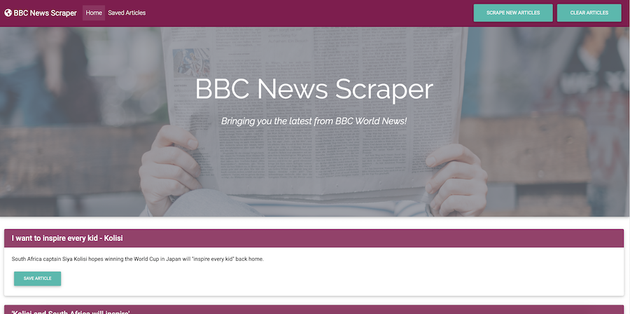
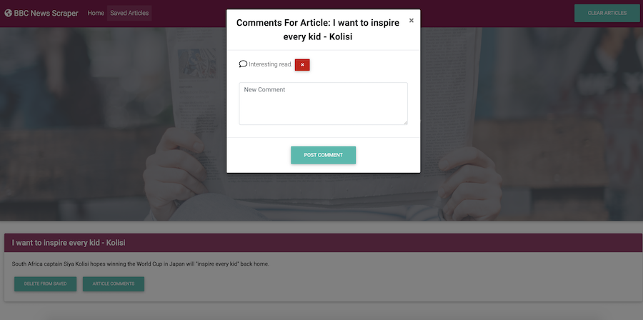

# MongoScraper

A full-stack web scraper that supplies the latest world news from BBC. Users can view articles on the BBC website, save articles to visit later, and delete previously saved articles. They can also leave comments on an article and view the comments of others.

### Technologies Used
- JavaScript
- Node.js
- Cheerio
- Axios
- Express
- jQuery
- MongoDB
- Mongoose
- Handlebars.js
- CSS
- MD Bootstrap framework

---

